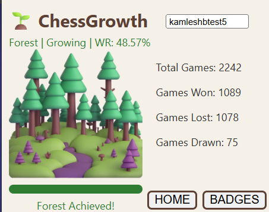
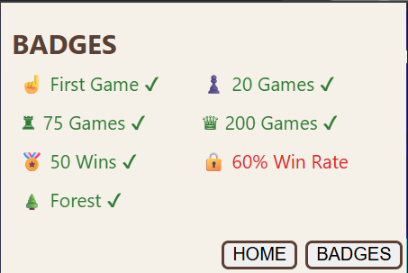

# 🌳 ChessGrowth

Transform your Lichess progress into a growing tree through achievements and performance tracking.

---

## Features

- 🌱 Tree progression based on games played
- 📊 Live Lichess statistics
- 🏆 Achievement badge system
- 📈 Animated progress bar
- 💚 Tree health based on win rate
- 💾 Saves your username automatically
- ✨ Badge unlock animations
- 🔄 Smooth page transitions

---

## Screenshots

### Home Page

### Badges Page

---

## Installation

1. Download or clone this repository.
2. Open Chrome.
3. Go to chrome://extensions.
4. Turn on Developer Mode.
5. Click **Load unpacked**.
6. Select the project folder.

---

## Built With

- HTML
- CSS
- JavaScript
- Chrome Extension API
- Lichess API

---

## Future Plans

- Chess.com support
- More tree artwork
- Daily streaks
- Additional achievements
- Theme customization

---

Created by Kamlesh B
